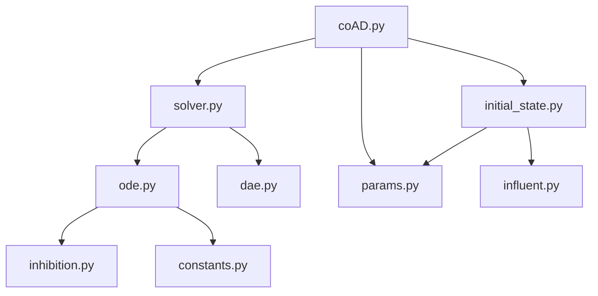

# Project Architecture & Code Organization

## Overview

The ADM1 simulation platform follows a modular, object-oriented architecture designed for maintainability, extensibility, and performance. This document outlines the system design and code organization principles.

## Architecture Principles

### 1. Separation of Concerns
- **Model Logic**: Pure mathematical/biochemical computations
- **Data Management**: Parameter handling and I/O operations
- **Visualization**: Plotting and reporting utilities
- **Analysis**: High-level scenario comparison and optimization

### 2. Modularity
- Independent, reusable components
- Clear interfaces between modules
- Plugin-ready architecture for extensions

### 3. Performance Optimization
- Efficient numerical methods
- Memory-conscious data structures
- Configurable precision levels

## Core Module Structure

```
adm1/                           # Core simulation engine
├── __init__.py                 # Module initialization
├── coAD.py                    # Co-digestion main interface
├── ode.py                     # ODE system definition
├── dae.py                     # DAE system for equilibrium
├── solver.py                  # Numerical integration methods
├── params.py                  # Parameter management
├── initial_state.py           # Initial condition setup
├── inhibition.py              # Inhibition kinetics
├── influent.py                # Feed composition models
└── constants.py               # Physical/chemical constants
```

### Module Dependencies



## Core Components Detail

### 1. coAD.py - Main Interface
**Purpose**: High-level API for co-digestion simulations

**Key Classes**:
```python
class CoDigestionSimulator:
    def __init__(self, params=None):
        """Initialize with default or custom parameters"""
    
    def run_simulation(self, mixing_ratio, duration):
        """Execute complete simulation workflow"""
    
    def validate_inputs(self, inputs):
        """Check parameter and input validity"""
```

**Responsibilities**:
- Input validation and preprocessing
- Simulation workflow orchestration
- Result post-processing and formatting
- Error handling and logging

### 2. solver.py - Numerical Methods
**Purpose**: Robust, efficient ODE/DAE solving

**Key Classes**:
```python
class ADM1Solver:
    def __init__(self, ode_system, tolerances):
        """Configure solver with system and precision"""
    
    def integrate(self, t_span, y0, method='DOP853'):
        """Solve system with adaptive step size"""
    
    def diagnose_failure(self, result):
        """Analyze convergence issues"""
```

**Features**:
- Multiple integration methods (RK45, DOP853, Radau)
- Adaptive error control
- Stiffness detection
- Mass balance monitoring

### 3. ode.py - System Definition
**Purpose**: Mathematical representation of ADM1 biochemical processes

**Structure**:
```python
def adm1_ode_system(t, y, params):
    """
    Define dy/dt = f(t, y, params) for ADM1
    
    Args:
        t: Time point
        y: State vector (35 variables)
        params: Model parameters
    
    Returns:
        dydt: Derivative vector
    """
```

**Process Categories**:
- Disintegration and hydrolysis (4 processes)
- Acidogenesis (7 processes) 
- Acetogenesis (3 processes)
- Methanogenesis (2 processes)
- Gas-liquid transfer (3 processes)

### 4. params.py - Parameter Management
**Purpose**: Centralized, validated parameter handling

**Key Functions**:
```python
def get_default_params():
    """Return validated default parameter set"""

def validate_params(params):
    """Check parameter ranges and consistency"""

def load_params_from_file(filepath):
    """Load parameters from JSON/YAML file"""

def update_params(base_params, **updates):
    """Safely update parameter subset"""
```

**Parameter Categories**:
- Kinetic constants (uptake rates, yields)
- Stoichiometric coefficients
- Inhibition parameters
- Physical properties (temperature, pH)
- Reactor configuration

## Utility Modules

### plot_utils.py - Visualization
**Purpose**: Standardized, publication-quality plots

**Key Functions**:
```python
def plot_methane_production(results, **kwargs):
    """Time series of biogas generation"""

def plot_substrate_dynamics(results, substrates):
    """Multi-substrate concentration profiles"""

def plot_ph_stability(results, highlight_events=False):
    """pH monitoring with stability indicators"""

def create_comparison_plots(scenario_results):
    """Multi-scenario comparative visualization"""
```

**Design Principles**:
- Consistent styling and coloring
- Configurable export formats
- Interactive capabilities (optional)
- Accessibility considerations

### scenario_compare_utils.py - Batch Analysis
**Purpose**: High-throughput scenario evaluation

**Key Functions**:
```python
def compare_scenarios(scenarios, metrics=['methane', 'stability']):
    """Run multiple scenarios with statistical analysis"""

def parameter_sensitivity_analysis(base_params, var_ranges):
    """Systematic parameter perturbation study"""

def optimization_study(objective_function, constraints):
    """Multi-objective optimization framework"""
```

## Data Flow Architecture

### 1. Input Processing
```
User Input → Validation → Parameter Merge → Initial Conditions
```

### 2. Simulation Execution
```
Initial State → ODE Integration → Event Detection → Result Collection
```

### 3. Output Generation
```
Raw Results → Post-processing → Validation → Export/Visualization
```

## Error Handling Strategy

### 1. Input Validation
- Parameter range checking
- Physical consistency validation
- Unit compatibility verification

### 2. Runtime Monitoring
- Integration convergence tracking
- Mass balance verification
- Stability analysis

### 3. Graceful Degradation
- Automatic solver switching
- Reduced precision fallback
- Partial result recovery

## Extension Points

### 1. Custom Inhibition Models
```python
class CustomInhibition(BaseInhibition):
    def calculate_factor(self, concentrations, params):
        """Implement custom inhibition kinetics"""
```

### 2. Alternative Feedstocks
```python
class CustomFeedstock(BaseFeedstock):
    def get_composition(self, mixing_ratio):
        """Define feedstock composition matrix"""
```

### 3. Advanced Solvers
```python
class CustomSolver(BaseSolver):
    def integrate_system(self, system, initial_state):
        """Implement specialized integration method"""
```

## Performance Considerations

### 1. Computational Efficiency
- Vectorized operations using NumPy
- Efficient sparse matrix operations
- Optimized integration tolerances

### 2. Memory Management
- Streaming output for long simulations
- Configurable result storage
- Memory pool for repeated runs

### 3. Scalability
- Parallel scenario execution
- Distributed parameter studies
- Cloud-ready containerization

## Testing Framework

### 1. Unit Tests
- Individual function validation
- Parameter edge case testing
- Mathematical accuracy verification

### 2. Integration Tests
- End-to-end simulation validation
- Multi-module interaction testing
- Performance benchmark tracking

### 3. Validation Tests
- Literature benchmark comparison
- Analytical solution verification
- Industrial data validation

## Documentation Standards

### 1. Code Documentation
- Comprehensive docstrings (Google style)
- Type hints for all functions
- Inline comments for complex logic

### 2. API Documentation
- Auto-generated from docstrings
- Usage examples for all functions
- Performance characteristics

### 3. User Guides
- Step-by-step tutorials
- Best practice recommendations
- Troubleshooting guides

## Future Enhancements

### 1. Model Extensions
- ADM1 extensions (temperature, pH dynamics)
- Multi-phase systems
- Biofilm modeling capabilities

### 2. User Interface
- Web-based simulation interface
- Real-time visualization dashboard
- Parameter optimization GUI

### 3. Integration Capabilities
- Process control system interfaces
- Database connectivity
- Cloud deployment options

This architecture ensures the ADM1 platform remains maintainable, extensible, and performant while providing a solid foundation for bioprocess engineering applications.